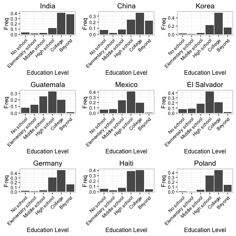

\
\
\


 **Here we conduct  a brief study of the foreign-born population in the United States based on the American Community Survey (ACS) published by the Census Bureau. We use the person-level data published for 2014, which includes 3,134,610 individuals. We focus on the foreign-born population, identified using the "NATIVITY" variable in the data, which consists of 360,677 individuals.** 
\
\


```{r libraries, message=FALSE, include=FALSE}
# Load libraries:
library(dplyr)
library(data.table)
library(DT)
library(ggplot2)
library(plotly)
library(scatterD3)
library(grid)
library(gridExtra)
```


```{r, message=FALSE, include=FALSE}
Load data and select variables:
selected.variables = c("NATIVITY","ST","SCHL", "YOEP", "AGEP","PWGTP","INDP","SOCP","COW","ESR","POBP",
                      "POVPIP","WAGP","FINCP","HINCP","FFINCP","FHINCP","OIP")
hus.a.data = fread("../data/ss14pusa.csv", select = selected.variables)
hus.b.data = fread("../data/ss14pusb.csv", select = selected.variables)
db = rbind(hus.a.data, hus.b.data)
rm(hus.a.data, hus.b.data)

# save(db, file = "../data/db.RData")
# load("../data/db.RData")
```


```{r, message=FALSE, include=FALSE}
# Get country names and state abbreviations:

countries = fread("../data/countrynames.csv")
db = db %>% 
    left_join(., countries, by = c("POBP" = "code")) %>%
    rename(COB_name = name)

states = fread("../data/statenames.csv")
db = db %>% 
    left_join(., states, by = c("ST" = "code")) %>% 
    rename(ST_abbr = abbr) %>% 
    select(-c(name))

statenames = states$name
names(statenames) = states$abbr

# remove DC and Puerto Rico rows:
db = filter(db, !ST_abbr %in% c('DC','PR'))
statenames = statenames[!statenames %in% c('District of Columbia','Puerto Rico')]
```


```{r, message=FALSE, include=FALSE}
# Find top countries of immigration:
top_n = 20 # the top how many countries of immigration
top_countries = db %>% 
                filter(NATIVITY==2) %>%
                group_by(COB_name) %>%
                summarise(sum(PWGTP)) %>%
                arrange(desc(`sum(PWGTP)`)) %>%
                head(top_n)
```


### Top `r top_n` countries of origin for immigrants in the United States:

| Rank |   |Country | Immigrant Population|
|------|---|--------|---------------------|
`r paste('|', 1:top_n, '|', paste('', sep=''), '|', top_countries[[1]], '|', round(top_countries[[2]]/1e6, 3), 'M', '|', '\n', collapse='')`
###### (Icons: <http://www.icondrawer.com>)


```{r, message=FALSE, include=FALSE}
# Estimate percent immigrant in state poulation:

pop_total = db %>% group_by(ST_abbr) %>% summarise(sum(PWGTP)) %>% rename(tot = `sum(PWGTP)`)
pct_imm_by_st_df = db %>% 
                  filter(NATIVITY==2) %>% 
                  group_by(ST_abbr) %>% 
                  summarise(sum(PWGTP)) %>% 
                  mutate(percent_imm = round(100*`sum(PWGTP)`/pop_total$tot, 1)) %>%
                  select(-`sum(PWGTP)`)

pct_imm_by_st = pct_imm_by_st_df$percent_imm
names(pct_imm_by_st) = pct_imm_by_st_df$ST_abbr
```


```{r, message=FALSE, include=FALSE}
# For each US state, get top countries of immigration:
top_n_st = 5 # the top how many countries of immigration to display
top_countries = list()
for(s in unique(db$ST_abbr)){
  state_rows = filter(db, ST_abbr==s & NATIVITY==2) # select only immigrants in state s
  top_countries[[s]] = state_rows %>%
                      group_by(COB_name) %>%
                      summarise(sum(PWGTP)) %>%
                      mutate(pct = round(100* `sum(PWGTP)` /sum(state_rows$PWGTP), 1)) %>%
                      select(-`sum(PWGTP)`) %>%
                      arrange(desc(pct)) %>%
                      head(top_n_st)
}
```
\
\


### Geographic distribution of immigrant groups:
\
\
```{r, message=FALSE, echo=FALSE}
# Display map:

nstates = length(top_countries)
hover = character(nstates)
percent_imm = numeric(nstates)

# prepare list for display of top countries of immigration:
for(i in names(statenames)){
  hover[i] = paste('<b>', statenames[i], ' ', pct_imm_by_st[i], '%</b>, of which:<br>',
                    paste('  ',top_countries[[i]]$COB_name, ' ', top_countries[[i]]$pct, '% <br>', collapse=""),
                    collapse="")
  percent_imm[i] = pct_imm_by_st[i]
}

# combine all in data frame for plotting
state_imm = data.frame(code = names(statenames), hover = hover, percent_imm = percent_imm, stringsAsFactors=FALSE)

# give state boundaries a white border
l = list(color = toRGB("white"), width = 2)

# specify some map projection/options
g = list(scope = 'usa', projection = list(type = 'albers usa'), showlakes = TRUE, lakecolor = toRGB('white'))

plot_ly(state_imm, type = 'choropleth', z = percent_imm, 
        locationmode = 'USA-states', locations = code, 
        hoverinfo = 'text', text = hover, 
        color = percent_imm, colors = 'Oranges',
        marker = list(line = l), 
        colorbar = list(len = 0.75, thickness = 20, title = "Percent foreign-born")) %>%
  
  layout(geo = g, 
         title = 'Percent foreign-born per state and top countries of origin <br> (hover cursor over map for breakdown)', 
         autosize = FALSE,
         width = 900,
         margin = list(t=25, l=0, r=0, d=0))

```


### Age, Year of entry and Age of arrival of different immigrant groups:

```{r, message=FALSE, include=FALSE}
# Compute weighed densities of Age, Year of Entry, and Age at Entry for different immigrant groups. Weighing is done using survey weights PWGTP

select_countries = c('Mexico', 'China', 'Cuba', 'India', 'Germany') # top_countries$COB_name
plot_data = filter(db, NATIVITY==2 & COB_name %in% select_countries)

ages = integer()
yoes = integer()
aoas = integer()
age_freqs = numeric()
yoe_freqs = numeric()
aoa_freqs = numeric()
countries = character()


for(country in select_countries){
  plot_data_c = filter(plot_data, COB_name==country)
  
  # weighed density of ages
  dens_c = with(plot_data_c, density(AGEP, weights=PWGTP/sum(PWGTP), bw=4, n=100, from=0, to=100))
  ages = c(ages, dens_c[[1]])
  age_freqs = c(age_freqs, dens_c[[2]])
  
  # weighed density of year of entry
  dens_c = with(plot_data_c, density(YOEP, weights=PWGTP/sum(PWGTP), bw=3, n=100, from=1920, to=2020))
  yoes = c(yoes, dens_c[[1]])
  yoe_freqs = c(yoe_freqs, dens_c[[2]])
  
  # weighed density age at entry
  dens_c = with(plot_data_c, density(AGEP-(2014-YOEP), weights=PWGTP/sum(PWGTP), bw=3, n=100, from=-10, to=100))
  aoas = c(aoas, dens_c[[1]])
  aoa_freqs = c(aoa_freqs, dens_c[[2]])
  
  countries = c(countries, rep(country,100))
}

# data frame for plotting:
density_data = data.frame(age = ages, yoe = yoes, aoa = aoas, age_freq = age_freqs, 
                          yoe_freq = yoe_freqs, aoa_freq = aoa_freqs, country = countries)
```


We show the age distributions of five important immigrant groups (although not the five largest): Mexico, China, Cuba, India and Germany. These densities take into consideration the survey weights assigned to each observation.

```{r, warning=FALSE, echo=FALSE, fig.height=4, fig.align='center'}

# age distributions:
ggplot(density_data, aes(age, age_freq, color=country)) + 
  geom_line() +
  theme_bw() + 
  labs(title='Age distribution per immigrant group', x='Age', y='Frequency', color='Country') +
  scale_x_continuous(breaks=seq(0,100,10))
```
\
We notice that German immigrants tend to be significantly older than other groups, with a most likely age of about 70 years old. Cuban foreign-born residents are the second oldest group, with a typical age of about 50. In constrast, the bulk of Mexican and Indian immigrants tends to be in their thirties. Interestingly, the Chinese foreign-born population appears to have a bimodal distribution, with most idividuals either in their mid-twenties or in their forties. \
These age differences might be explained by the year in which each group entered the United States. We look at this next.
\
\

 
```{r, warning=FALSE, echo=FALSE, fig.height=4, fig.align='center'}
# year of entry distributions:
ggplot(density_data, aes(yoe, yoe_freq, color=country)) + 
  geom_line() +
  theme_bw() + 
  labs(title='Frequency of year of entry per immigrant group', x='Year of entry', y='Frequency', color='Country') +
  xlim(c(1920,2010)) +
  annotate("text", x=1957, y=0.027, label='Post-WWII') +
  annotate("text", x=1967, y=0.018, label='Cuban Rev.') 
```
\
As suggested by the age distributions, we see that the large majority of the German group arrived in the coutry the earliest, in the two decades following World War II. The Cuban group followed, most likely pushed to exile by the revolution of 1953-59. We also see that the Mexican wave of immigration seems to have peaked around 2000, whereas Chinese and Indian immigration appears to not yet have reached its peak.\
Finally, we look at the distribution of the age of arrival, computed by subtracting the years since arrival (2014 - year-of-entry) to the current age.
\
\


```{r, warning=FALSE, echo=FALSE, fig.height=4, fig.align='center'}
# age at entry distributions:
ggplot(density_data, aes(aoa, aoa_freq, color=country)) + 
  geom_line() +
  theme_bw() + 
  labs(title='Distribution of age of arrival per immigrant group', x='Age of arrival', y='Frequency', color='Country') +
  xlim(c(0,75)) 
 
```
\
We see a general trend in most groups to immigrate to the country in their twenties. There is also evidence of a smaller mode at 0-10 years of age for most distributions, which suggests that a lot of foreign-born residents entered the country as small children.

\
\
\
  
    
### Now let's talk about education!
\
\
\

```{r echo = FALSE, message= FALSE, fig.align='center', fig.width=4, fig.height=3}
db_native = filter(db, NATIVITY == 1)
db_foregin = filter(db, NATIVITY == 2)
db_foregin = mutate(db_foregin, Age_of_Entry = AGEP - (2014 - YOEP))

#break education level into groups
db_foregin = mutate(db_foregin, edu_level = cut(db_foregin$SCHL, breaks = c(1,3,7,11,16,21,24), labels = c('No school', 'Elementary school','Middle school','High school','College','Beyond'),include.lowest = T ))

db_native = mutate(db_native, edu_level = cut(db_native$SCHL, breaks = c(1,3,7,11,16,21,24), labels = c('No school', 'Elementary school','Middle school','High school','College','Beyond'),include.lowest = T ))

db_native = filter(db_native, !is.na(edu_level))
#showing the distribution of the education level of us-born Americans
ggplot(db_native, aes(edu_level)) + geom_bar(aes(weights = PWGTP/sum(PWGTP)), position = 'dodge') + scale_x_discrete() + 
  theme_bw() + theme(axis.text.x = element_text(angle = 45, hjust = 1)) + labs(title = 'U.S.-born population', x = 'Education Level', y = 'Freq') 
```
\
\
\
So as we can see here,most of the US-born Americans have gone to college or have an associate degree or other certifications. And people who have went to high school and college add up to around 70 percent of the population. So let's see what's the scenario for other countries.
\
\
```{r echo = FALSE, fig.align='center'}
#temporary dataset with only top 20 countries
top_db = filter(db_foregin, (COB_name %in% top_countries$COB_name) & !is.na(edu_level))

#store education level dist figure in a list
graph_list = list()

for (country in top_countries$COB_name){
  temp = filter(top_db, COB_name == country)
  graph_list[[country]] = ggplot(temp, aes(edu_level)) + geom_bar(aes(weights = PWGTP/sum(PWGTP)), position = 'dodge') + scale_x_discrete() + 
  theme_bw() + theme(axis.text.x = element_text(angle = 45, hjust = 1)) + labs(title = country, x = 'Education Level', y = 'Freq') 
}

#png(filename = "../figs/Education_level.png")
#grid.arrange(graph_list$India, graph_list$China, graph_list$Korea,
#             graph_list$Guatemala, graph_list$Mexico, graph_list$`El Salvador`,
#             graph_list$Germany, graph_list$Haiti,graph_list$Poland,nrow = 3)
#dev.off()
#Have no idea why the F** it doesn't work in R Markdown
```


\
\
\
The graphs above are all from countries within our top 20 list. I've organized it a bit so that the first row is all Asian countries, and vast majority of Asian people in state posses a higher education degree, especially the percentage of people having a master or doctorate degree are around 20%, or even goes up to 40% like India, which is way higher than the US-born Americans. And as we see before, the era of Asian immigration has just began, a lot of well-educated Asian people are coming into US. We'll see a bit more later.
\
\
The second row is countries from America, the most common education background as we see in the graph is high school level. In the third row we got Germany and Poland from Europe, the distribution is kind of similar to Asian countries with most of the people in the college level, and a larger proportion of master and doctorate degrees.
\
\
```{r echo = FALSE, message = FALSE, warning=FALSE}
top_60 = db_foregin %>% 
                group_by(COB_name) %>%
                summarise(sum(PWGTP)) %>%
                arrange(desc(`sum(PWGTP)`)) %>%
                head(60)

top_countries = top_60$COB_name
db_top = filter(db_foregin, COB_name %in% top_countries)
COB = character()
avg_edu = integer()
mode_edu = integer()
weighted_population = numeric()
Peak_entry = integer()
mode_age = integer()

for (country in top_countries){
  temp = filter(db_top, COB_name == country)
  
  #calculate the mode
  edu_dist = temp %>%
      group_by(SCHL) %>%
      summarise(n = sum(PWGTP)) %>%
      arrange(desc(n))
  
  #peak year of immigration
  AoE_dist = temp %>%
      group_by(YOEP) %>%
      summarise(n = sum(PWGTP)) %>%
      arrange(desc(n))
  
  #calculate the mode age
  age_dist = temp %>% 
      group_by(Age_of_Entry) %>%
      summarise(n = sum(PWGTP)) %>%
      arrange(desc(n))
  
  Peak_entry = c(Peak_entry, AoE_dist$YOEP[1])
  COB = c(COB, country)
  avg_edu = c(avg_edu, sum(temp$SCHL * temp$PWGTP / sum(temp$PWGTP), na.rm = TRUE))
  mode_edu = c(mode_edu, edu_dist$SCHL[1])  
  mode_age = c(mode_age, age_dist$Age_of_Entry[1])
  weighted_population = c(weighted_population, sum(temp$PWGTP))
}
rm(temp, edu_dist, db_top)
edu_by_country = data.frame(COB = COB,  mode_edu = mode_edu, Peak_immigration_Year = Peak_entry, weighted_population = weighted_population, mode_age = mode_age)
datatable(edu_by_country, options = list(searching = FALSE))
```
\
\
\

```{r echo = FALSE, message= FALSE, warning= FALSE, fig.align='center'}
#ploting
plot_data = edu_by_country
edu_level = c('No school completed', 'Preschool', 'Kindergarten',paste('Grade', seq(1,12)), 'High school diploma','Alternative credential', 'Some college (<1 year)','1 or more year of college credit', 'Associate degree', 'Bachelor degree', 'Master degree', 'Professional degree beyond bachelor', 'Doctorate degree')
for (i in 1:24 ){
  plot_data$mode_edu[plot_data$mode_edu == i] = edu_level[i]  
}
plot_data = slice(plot_data, 1:30)

attach(plot_data)
scatterD3(Peak_immigration_Year,mode_edu, col_var = COB, xlab = "Peak Immigration Year", ylab = 'Most common education Level', xlim = c(1950, 2015), size_var = weighted_population)
detach(plot_data)
```
\
In the upper right corner are the countries with more recent immigration peak and higher education level, which as we expect to have lots of Asian countries. It corresponds to the prior analysis that it's the era of Asian immigration has just started :)
\
\
    
'We hold these truths to be self-evident, that all men are created equal.' -Thomas Jefferson 
  
### So do people from foreign countries really have an equal chance in getting education?
\
\
We took a look at the overall distribution of education level for foreign-born kids in United states.  
'Foreign-born kids' here are defined as those who came to US before age 6, the time when most US-born kids start elementary school.
\
\
``` {r echo = FALSE, warning = FALSE, fig.align='center', fig.width=4, fig.height=3}
#find the age of a US-born kid start school
age_dist = db_native %>% 
  filter(SCHL == 4) %>%
  group_by(AGEP) %>%
  summarise(n = n()) %>%
  arrange(desc(n))
staring_age_elementary = age_dist$AGEP[1] 
#most of the American kids start elementary school at age 6

#dataset of immigrants who come to US at age under 6
db_foregin_kid = filter(db_foregin, Age_of_Entry < 6)
#overall picture of foreign kid in US
db_foregin_kid = mutate(db_foregin_kid, edu_level = cut(db_foregin_kid$SCHL, breaks = c(1,3,7,11,16,21,24), labels = c('No school', 'Elementary school','Middle school','High school','College','Beyond'),include.lowest = T ))
db_foregin_kid = filter(db_foregin_kid, !is.na(db_foregin_kid$SCHL))

ggplot(db_foregin_kid, aes(edu_level)) + geom_bar(aes(weights = PWGTP/sum(PWGTP)), position = 'dodge') + scale_x_discrete() + 
  theme_bw() + theme(axis.text.x = element_text(angle = 45, hjust = 1)) + labs(title = 'Foreign-born kids in the US', x = 'Education Level', y = 'Freq') 
```
\
\
It looks pretty similar to the distribution of US-born American's education level that we've shown before, but with a bit higher proportion in middle school and a bit lower in college, which is reasonable since a lot of young kids came to the states during the big wave of immigration around year 2000 - 2005, and by now they should have a middel school degree.
\
\
\
Here we define another variable, the 'fall-behind ratio'. 
Going to school, especially elementary and middle school, is very much like climbing a ladder. For example at age 6, you started with Grade 1, and most of the times you'll be in Grade 2 at age 7.
We define as fall-behind being a certain number of years behind this 'shedule', in the extreme case, a 50 year old person whose education record is elementary school, we strongly believe that he has dropped out, and the fall-behind ratio would be the number of fallen-behind people divided by the population at the same education level
Here we choose the amount of years to be 2, in consider for any gap year or later enrollment, then compare the fall-behind ratio between US- and foreign-born kids.
\
\
\
```{r echo = FALSE, warning = FALSE, fig.align='center'}
drop_out_rate <- function(data, lag = 2, edu = 4){
  age_dist = data %>% 
    filter(SCHL == edu) %>%
    group_by(AGEP) %>%
    summarise(n = n()) %>%
    arrange(desc(n))
    most_common_age = age_dist$AGEP[1]
  population = sum(age_dist$n, na.rm = T)
  age_dist = filter(age_dist, AGEP > most_common_age + lag)
  over_age_population = sum(age_dist$n, na.rm = T)
  return (over_age_population/population)
}

native_dropout_rate = numeric()
foreign_dropout_rate = numeric()
for (edu in seq(4,14)){
   native_dropout_rate = c(native_dropout_rate, drop_out_rate(db_native,3,edu))
   foreign_dropout_rate= c(foreign_dropout_rate, drop_out_rate(db_foregin_kid,2,edu))
}
dropout_comparison = data.frame(edu_level = rep(seq(4,14),2), drop_out_rate = c(native_dropout_rate, foreign_dropout_rate), indicator = c(rep('US-born',11,),rep('Foreign-born',11)))

ggplot(dropout_comparison, aes(x = edu_level, y = drop_out_rate, color = indicator)) + geom_path() + theme_bw() + labs(x = 'Education Level', y = 'Fall-behind rate', title = 'Fall-behind rate comparison') + scale_x_discrete(limits = c(6,9,12,14),labels = c('Grade 4', 'Grade 7','Grade 10', 'Grade 12'))
```
\
\
\
So it seems that fall-behind ratio is very similar during elementary school and middle school, but when going to high school the fall-behind rate went sky high for US-born Americans.
My explanation would be that it's quite common here in US to go back to school and get a degree after working a few years, and having a full-time job is not an option before high school, so the fall-behind ratio is rather close in that period.
\
\
\
\
  
    
### Let's take a look at the employment status of immigrants in the U.S.

\
After comparing several similiar employment-related variables, we chose Class of Worker(COW), Employment Status Record(ESR) and Industry Field Record (INDP) as three attributes to evalute the employment situations of the immigrants in the U.S.


\
Once again, we choose to focus on 5 intersting example countries of origin among the top 20: Mexico, China, Cuba, Canada and Germany. As they are in South America, Asia, Middle America, North America and Europe, I think these five countries are representative. 
 
```{r, echo = FALSE}
select_countries = c('Mexico','China', 'Cuba', 'Canada', 'Germany') # top_countries$COB_name
plot_data = filter(db, NATIVITY==2 & COB_name %in% select_countries)
```


```{r, echo=FALSE, fig.align='center'}
 #bar chart about class of worker in the typical countries, use the variable COW
species = c(rep("Mexico",10),rep("China",10),rep("Cuba",10),rep("Canada",10),rep("Germany",10))
conditions = rep(c("for wages","none-profit","local government","state government","fedral government","Self-employed in own not incorporated","Self-employed in own incorporated","Working without pay(family business or farm)","unemployed","less than 16"),5)

count_country_class_num = matrix(nrow = 5,ncol = 10)
for(i in 1:5){
  for(j in 0:9){
    count_country_class_num[i,j]=dim(filter(plot_data,COW==j & COB_name==select_countries[i]))[1]
  }
}
less_than_16 = vector()
for (i in 1:5){
  less_than_16[i] = sum(is.na(plot_data$COW) & plot_data$COB_name==select_countries[i])
}
count_country_class_num[,10]=less_than_16

values = as.numeric(matrix(data = count_country_class_num,nrow = 1,byrow = FALSE))
data = data.frame(species,conditions,values)
p <- ggplot(data, aes(fill=conditions, y=values, x=species))
p + geom_bar(position="dodge", stat="identity") + labs(title='Class of worker', x='Countries', y='Values', fill='Class')
```
\
From the above Class of Workers graph, we may conclude that Mexico has significant high level of people who immigrate to the U.S working for wages. An interesting result also shows that Germany has the most immigrants to who work in the U.S.for self-employed in their own but not incorporated companies.

```{r, echo=FALSE, message=FALSE, fig.align='center'}
#bar chart about the Employment status recode, using the variable ESR
under16 = vector()
for ( i in 1:5){
  under16[i]=sum(is.na(filter(plot_data,plot_data$COB_name==select_countries[i])$ESR))
  #print(table(filter(plot_data,plot_data$COB_name==select_countries[i])$ESR))
}
values_esr = c(3574,52489,1241,3855,61,3,29786,1104,8909,288,531,20,0,7370,345,4853,93,
               382,9,0,4346,14,4118,149,201,10,0,3928,121,2489,74,128,14,0,3629)
species_esr= c(rep("Mexico",7),rep("China",7),rep("Cuba",7),rep("Canada",7),rep("Germany",7))
conditions_esr = rep(c("under 16","civilian employed and at work","civilian employed without work","unemployed",
                       "armed forces, at work","armed forces without work","not in labor force"),5)
data_esr = data.frame(species_esr,conditions_esr,values_esr)
p <- ggplot(data_esr, aes(fill=conditions_esr, y=values_esr, x=species_esr))
p + geom_bar(position="dodge", stat="identity") + labs(title='Employment Status Recode', 
                                                       x='Countries', y='Values', fill='Employment Status')

```

\
As we can see from the employment status recode graph, Mexican people surplus other countries of the total immigrants to the U.S. The civilian employed at work and not in labor force also take a large percentage. China ranks second and the other three countries all have the similar patterns, showing that people who are civilian employed and at work and not in labor force are the main status of the migrants in the U.S.

```{r, echo=FALSE, message=FALSE}
#bar chart about Industry recode using the variable INDP
#classify industry through INDP fisrt three letters
AGR = c(170,180,190,270,280,290)
EXT = c(370,380,390,470,490)
UTL = c(570,580,590,670,680,690)
CON = c(770)
MFG = c(1070,1080,1090,1170,1180,1190,1270,1280,1290,1370,1390,1470,1480,1490,1570,1590,1670,1680,1690,1770,1790,1870,1880,1890,1990,2070,2090,2170,2180,2190,2270,2280,2290,2370,2380,2390,2470,2480,2490,2570
        ,2590,2670,2680,2690,2770,2780,2790,2870,2880,2890,2970,2980,2990,3070,3080,3095,3170,3180,3190,3365,3370,3380,3390,3470,3490,3570,3580,3590,3670,3680,3690,3770,3780,3790,3875,3895,3960,3970,3980,3990)
WHL = c(4070,4080,4090,4170,4180,4195,4265,4270,4280,4290,4370,4380,4390,4470,4480,4490,4560,4570,4580,4585,4590)
RET = c(4670,4680,4690,4770,4780,4795,4870,4880,4890,4970,4980,4990,5070,5080,5090,5170,5180,5190,5275,5280,5295,5370,5380,5390,5470,5480,5490,5570,5580,5590,5591,5592,5670,5680,5690,5790)
TRN = c(6070,6080,6090,6170,6180,6190,6270,6280,6290,6370,6380,6390)
INF = c(6470,6480,6490,6570,6590,6670,6672,6680,6690,6695,6770,6780)
FIN = c(6870,6880,6890,6970,6990,7070,7080,7170,7180,7190)
PRF = c(7270,7280,7290,7370,7380,7390,7460,7470,7480,7490,7570,7580,7590,7670,7680,7690,7770,7780,7790)
EDU = c(7860,7870,7880,7890)
MED = c(7970,7980,7990,8070,8080,8090,8170,8180,8190,8270,8290)
SCA = c(8370,8380,8390,8470)
ENT = c(8560,8570,8580,8590,8660,8670,8680,8690)
SRV = c(8770,8780,8790,8870,8880,8970,8980,8990,9070,9080,9090,9160,9170,9180,9190,9290)
ADM = c(9370,9380,9390,9470,9480,9490,9470,9480,9490,9570,9590)
MIL = c(9670,9680,9690,9770,9780,9790,9870)
UNEMPLOYED = 9920
foreignkey1 = c(AGR,EXT,UTL,CON,MFG,WHL,RET,TRN,INF,FIN,PRF,EDU,MED,SCA,ENT,SRV,ADM,MIL,UNEMPLOYED)
foreignkey2 = c(rep("AGR",length(AGR)),rep("EXT",length(EXT)),rep("UTL",length(UTL)),rep("CON",length(CON))
                ,rep("MFG",length(MFG)),rep("WHL",length(WHL)),rep("RET",length(RET)),rep("TRN",length(TRN))
                ,rep("INF",length(INF)),rep("FIN",length(FIN)),rep("PRF",length(PRF)),rep("EDU",length(EDU))
                ,rep("MED",length(MED)),rep("SCA",length(SCA)),rep("ENT",length(ENT)),rep("SRV",length(SRV))
                ,rep("ADM",length(ADM)),rep("MIL",length(MIL)),rep("UNEMPLOYED",length(UNEMPLOYED)))
foreignkeys = as.data.frame(cbind(foreignkey1,foreignkey2))
names(foreignkeys)[1] = "INDP"
plot_data1 = merge(plot_data, foreignkeys, by=c("INDP"))
Mexico = filter(plot_data1,COB_name=="Mexico")
China = filter(plot_data1,COB_name =="China")
Cuba = filter(plot_data1,COB_name == "Cuba")
Canada = filter(plot_data1,COB_name == "Canada")
Germany = filter(plot_data1,COB_name =="Germany")
Mexico_num = as.numeric(table(Mexico$foreignkey2))
China_num = as.numeric(table(China$foreignkey2))
Cuba_num = as.numeric(table(Cuba$foreignkey2))
Canada_num = as.numeric(table(Canada$foreignkey2))
Germany_num = as.numeric(table(Germany$foreignkey2))
num_mat = rbind(Mexico_num,China_num,Cuba_num,Canada_num,Germany_num)
less_than_16_INPD = vector()
for (i in 1:5){
  less_than_16_INPD[i]=sum(is.na(filter(plot_data,COB_name == select_countries[i])$INDP))
}
total_num_mat = cbind(less_than_16_INPD,num_mat)
total_num_val = matrix(t(total_num_mat),ncol  = 1,byrow = TRUE)
species_INDP = c(rep("Mexico",20),rep("China",20),rep("Cuba",20),rep("Canada",20),rep("Germany",20))
conditions_INDP = rep(c("under 16","AGR","EXT","UTL","CON","MFG","WHL","RET","TRN","INF","FIN","PRF","EDU","MED","SCA","ENT","SRV","ADM","MIL","UNEMPLYED"),5)
data_INDP = data.frame(species_INDP,conditions_INDP,total_num_val)
p<-ggplot(data_INDP,aes(fill=conditions_INDP,y=total_num_val,x=species_INDP))
p+geom_bar(position = "dodge",stat = "identity")+labs(title="Industry fields record in different countries")
```
\
From this industry record graph, we know that the teenagers take the most percentage in all five countries. Mexicans also take a large percentage in finance, manufacturing as well as United Telecoms Limited industrial areas.

